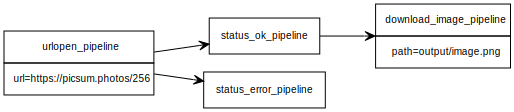

# Pypeyuml

Experimental pipeline runner for Python, powered by yUML.

## Motivation

A node-based application alternative for developers who can't use ComfyUI for image generation.

## Usage

Create a `.yuml` file following the [class diagram syntax](https://github.com/jaime-olivares/yuml-diagram/wiki#class-diagram).



Each pipeline step must have a corresponding Python file with a function named using the following convention:

```py
# urlopen_pipeline.py

from urllib.request import urlopen

def urlopen_pipeline(url: str, **kwargs):
  return { "response": urlopen(url) }
```

When a pipeline function returns a dictionary, its values will be passed as keyword arguments (`**kwargs`) to the next pipeline in the chain.

> ⚠️ If a function returns `None`, it will stop the execution of the subsequent pipelines.

## Loops

When a pipeline function returns a list of dictionaries, the next pipelines will be executed once for each item in the list.